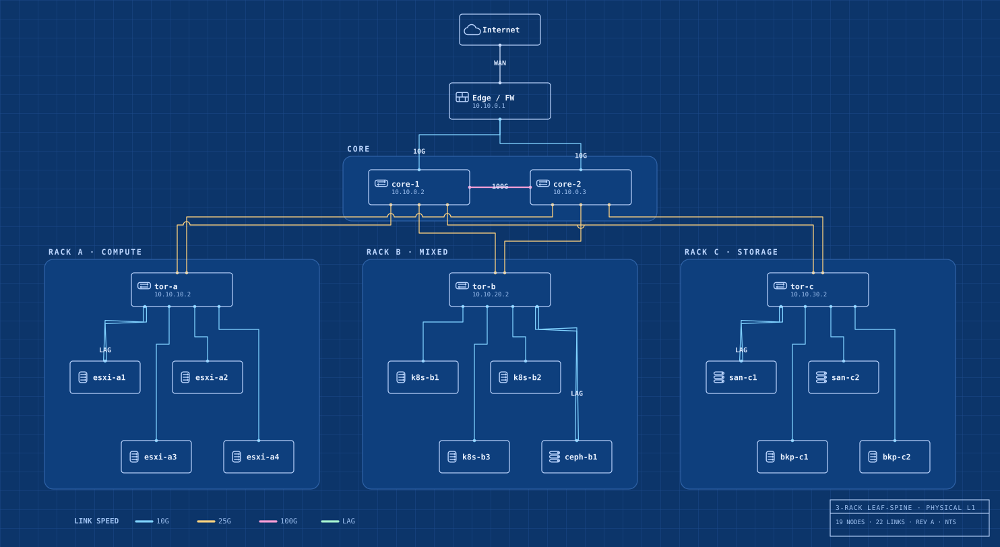
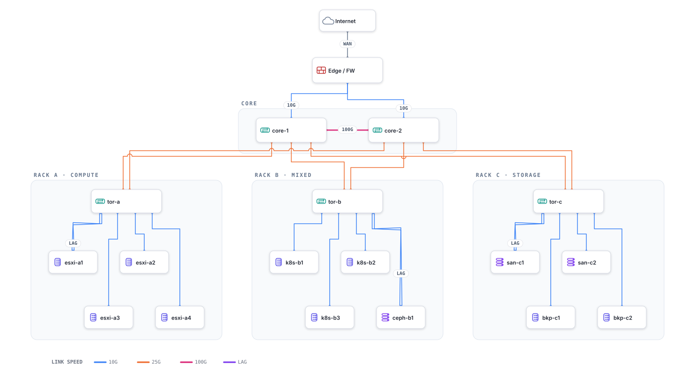
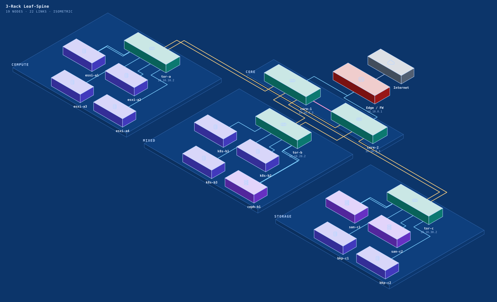
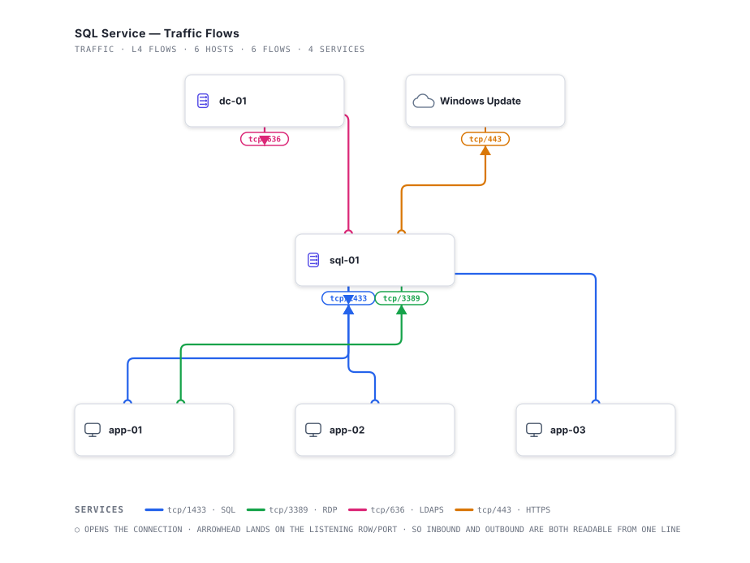
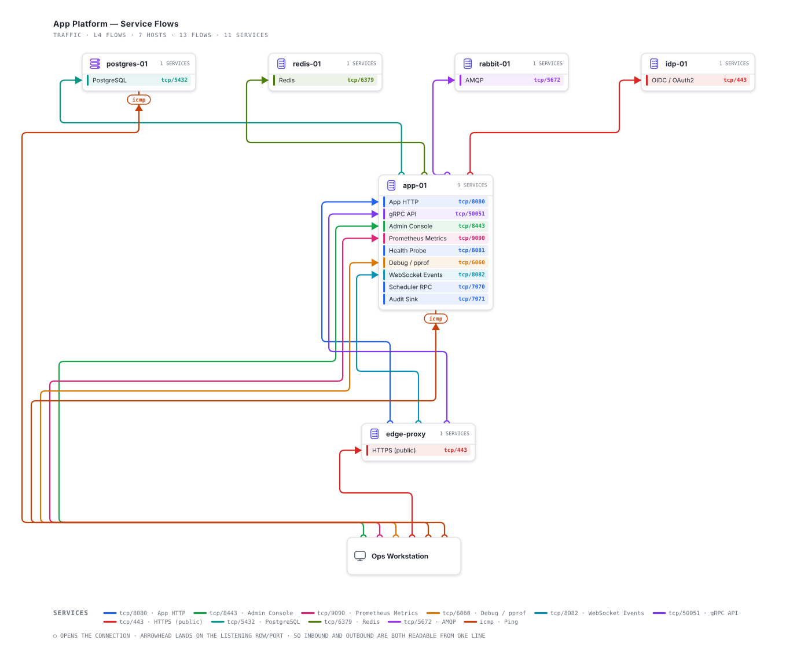
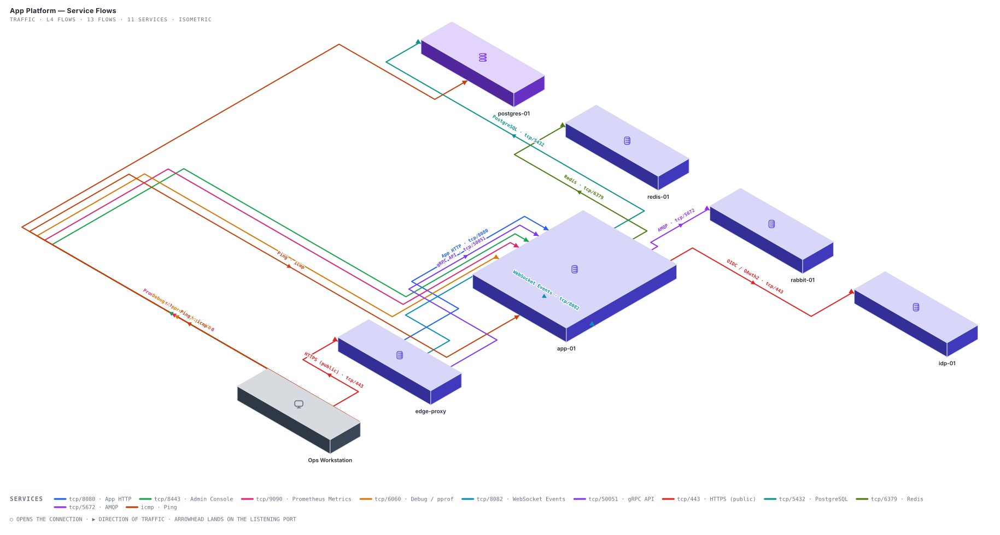

# NetScript

**Diagram-as-code for network topology — physical, logical, and traffic.** Describe your devices, ports, links, VLANs, bonds and service flows in a declarative model; get clean, Visio-grade SVG — flat or isometric, in any theme. No drag-and-drop, no hand-placed coordinates. Callable as text-to-diagram from any MCP client.

> **Status: early (v0.1).** Physical + logical + traffic layers, `.net` text DSL, a live editor, an MCP server, and flat + isometric projections are all working today. Importers/discovery and SysML interchange are still on the roadmap below.

---

## Why

Network diagrams rot. You draw them once in Visio/draw.io, the lab changes, and the picture lies within a month. NetScript treats the **diagram as a projection of a model** — so the same source can render as a clean doc, a dark NOC view, or a blueprint schematic, and (eventually) be regenerated automatically from what your gear actually reports.

## Preview

Same model, two themes — a three-rack leaf-spine (WAN edge → redundant core pair → top-of-rack switches → servers/storage, with dual-homed uplinks and LAG bonds):

**Blueprint**



**Clean**



## Quickstart

Requires **Node 24+** (runs the TypeScript sources directly via type-stripping).

```bash
git clone https://github.com/kilrkrow/netscript.git
cd netscript

# render the bundled example
node src/cli.ts --example three-rack --theme blueprint -o diagram.svg
node src/cli.ts --example three-rack --theme clean     -o diagram.svg
```

Or from code:

```ts
import { renderModel, threeRack } from "@kilrkrow/netscript";

const svg = renderModel(threeRack, "blueprint");
```

## Live editor

A self-contained browser editor lives in [`editor/`](editor/) — type `.net` on the left, watch the diagram render live on the right. No backend, no build step required to run it.

- **Caret-aware autocomplete** — device kinds, tiers, link speeds, and existing device IDs, from the typed grammar + a live symbol table.
- **Inline diagnostics** — line-numbered parser errors in the status bar.
- **Prebuilt samples** — *three-rack leaf-spine*, *small lab*, *starter* — in the picker.
- **Theme switch** (clean / blueprint), **Export SVG**, and **Copy link** (the diagram is encoded in the URL `#fragment` — shareable with zero backend).

Run it:

```bash
npm run build:editor          # regenerate editor/netscript.js (Node 24 only — no deps)
# then serve the folder (ES-module-free bundle, so file:// works too):
python3 -m http.server -d editor 8080   # → http://localhost:8080
```

Host it for free on **GitHub Pages** (Settings → Pages → deploy from `main`) — the editor is then at `…/netscript/editor/`. No Cloudflare Worker needed; a Worker only enters the picture later for the server-side LLM generation path.

## MCP server

NetScript is callable as an [MCP](https://modelcontextprotocol.io) tool — text-to-diagram from any MCP-capable agent (Claude Desktop, Claude Code, etc.), mirroring [FlowScript](https://github.com/kilrkrow/flowscript)'s server:

```bash
netscript mcp     # stdio transport
```

Claude Desktop config:

```json
{
  "mcpServers": {
    "netscript": { "command": "npx", "args": ["-y", "@kilrkrow/netscript", "mcp"] }
  }
}
```

Two tools:

- **`compile_net`** — structured JSON (devices, links, racks, optionally ports/services/VLANs/bonds/flows) → `{ net, svg }`. Your LLM extracts the topology; the tool handles NetScript syntax, layout, routing and rendering. No `.net` knowledge required of the caller.
- **`render_net`** — `.net` source text → SVG. Use this when you already have source (hand-authored, or from `compile_net`).

Both accept `theme`, plus the two independent axes `view` (`"topology"` | `"traffic"`) and `projection` (`"flat"` | `"iso"`) — see [Views and projections](#views-and-projections). `compile_net` renders directly from the constructed model — the returned `net` text is for you to read/edit, not a round-trip dependency for the SVG.

## The model

A `NetModel` is layout-free — you describe *what connects to what*, and NetScript places and routes it:

```ts
import type { NetModel } from "@kilrkrow/netscript";

const model: NetModel = {
  title: "Home Lab",
  racks: [{ id: "A", label: "Rack A", role: "Compute" }],
  devices: [
    { id: "edge",  kind: "firewall", label: "Edge / FW", tier: "edge", mgmt: "10.10.0.1" },
    { id: "core1", kind: "switch",   label: "core-1",    tier: "core", mgmt: "10.10.0.2" },
    { id: "a-tor", kind: "switch",   label: "tor-a",     tier: "tor",  rack: "A", mgmt: "10.10.10.2" },
    { id: "a-s1",  kind: "server",   label: "esxi-a1",   tier: "host", rack: "A" }, // host: no address
  ],
  links: [
    { a: "edge",  b: "core1", speed: "10G" },
    { a: "a-tor", b: "core1", speed: "25G" },               // uplink
    { a: "a-tor", b: "a-s1",  speed: "10G", bond: true },   // LAG / dual-home
  ],
};
```

`tier` (`wan` · `edge` · `core` · `tor` · `host`) drives layout and lets the router infer each link's class (uplink, peer, intra-rack, …). `bond: true` draws a link as an offset parallel pair with a `LAG` tag. `mgmt` is an optional **management address** on managed gear only — hosts carry none, and there are no CIDRs at the physical layer (addressing is logical — see below).

### Logical layer — VLANs, bonds, ports (text DSL)

Ports, VLANs and LAG bonds are first-class in `NetModel` and now authorable directly in `.net` text, not just via the TS API:

```
edge firewall "edge-fw" tier edge mgmt 10.0.0.1 {
  port wan0 "wan0" speed WAN media RJ45 addr dhcp
  port lan0 "lan0" speed 10G media SFP+ addr 10.0.0.1/24
}

tor1.g1 -> srv1.eth0 : 10G lag       # link ports with a "device.port" endpoint

vlan 20 "data" subnet 10.0.20.0/24 {
  member core1.te2 tagged
  member tor1.g1 tagged
}

bond lag1 on srv1 mode lacp {
  member eth0
  member eth1
}
```

Listening services and traffic flows (L4) are authorable too — see [Traffic](#traffic--the-flow-layer-l4):

```
sql01 server "sql-01" {
  service db "SQL Server" tcp/1433 exe sqlservr.exe
}
flow app1 -> sql01.db
```

See [`examples/homelab-logical.net`](examples/homelab-logical.net), [`examples/sql-traffic.net`](examples/sql-traffic.net) and [`examples/service-stack.net`](examples/service-stack.net) for full examples, and the grammar comment atop [`src/parser.ts`](src/parser.ts) for the complete syntax. `serializeNet(model)` ([`src/serialize.ts`](src/serialize.ts)) is the inverse — NetModel → `.net` text — used by `compile_net` to hand back editable source. Render a VLAN-coloured view with the `*-logical` / `*-hybrid` themes (`--theme blueprint-hybrid`).

## How it works

```
model → layout → router → render
```

- **layout** — deterministic tiered/rack placement: edge on top, a centered core pair, then rack columns with a top-of-rack switch over staggered hosts. Zone boxes are derived from device bounds.
- **router** — orthogonal cabling with **per-tier lane allocation** (so parallel runs never overlap), **uplink risers** with core-side port fan-out (so dual-home uplinks don't converge on one point), per-rack local lanes, and **line-jumps only where a crossing is genuinely unavoidable**.
- **render** — a pure view: positioned model + theme → SVG. Swapping themes never touches the model.

This is the load-bearing idea: **the model is the source of truth; every rendering is a view over it.**

## Themes

| Theme | Use |
|-------|-----|
| `clean` | White, Visio-like — the neutral documentation default. |
| `blueprint` | Schematic blue, management addresses, title block — high-density "as-built". |

More (dark NOC, monochrome, icon-rich) are straightforward to add — a theme is just a token set.

## Views and projections

Two **independent** axes, because isometric is a projection of a scene, not a kind of scene. Every combination is valid:

| | `--projection flat` | `--projection iso` |
|---|---|---|
| **`--view topology`** *(default)* | devices + cabling, 2D | the same layout, projected |
| **`--view traffic`** | L4 service flows | the same flows, projected |

```bash
node src/cli.ts --example three-rack --projection iso           -o diagram.svg
node src/cli.ts examples/sql-traffic.net --view traffic         -o diagram.svg
node src/cli.ts examples/sql-traffic.net --view traffic --projection iso -o diagram.svg
```

From code, one entry point covers the grid — `renderView(model, { theme, view, projection })` ([`src/views.ts`](src/views.ts)).

*(Layer choice **within** the topology view — physical vs logical vs hybrid — is a third, separate thing carried by the theme, e.g. `--theme blueprint-hybrid`.)*

### Isometric



[`src/iso.ts`](src/iso.ts) reuses each scene's layout completely unchanged — it projects the *existing* positions and routed polylines through a true isometric transform, so an orthogonal run becomes the classic two-diagonal isometric cable look for free. Devices draw as extruded blocks with the kind glyph billboarded flat on the top face (readable, not skewed); racks become shallow platforms underneath.

Scope: fixed extrusion heights, no light/shadow model, no VLAN colouring yet — a documentation-grade projection, not a photorealistic renderer.

### Traffic — the flow layer (L4)

Where the physical view answers *"what is cabled to what"* and the logical view answers *"what segment is this on"*, the traffic view answers **"what talks to what, on which service, and in which direction"** — the question a firewall rule set is made of.



```
flow app1 -> sql01 : tcp/1433 "SQL"      # inbound to sql01, from the client's point of view outbound
flow sql01 -> dc01 : tcp/636  "LDAPS"    # sql01's own outbound call
```

Three ideas carry the drawing:

- **Colour encodes the service** (`tcp/1433`, `tcp/443`, …) — every line of one colour is the same service wherever it appears. Palette order follows *declaration* order, so the flow you write first gets the lead colour. Past the palette's 16 entries a dash pattern joins in as a second channel, because a legend that lists twenty services against eight swatches looks authoritative while being unable to tell them apart.
- **Direction encodes intent.** An arrow runs initiator → listener and lands on a labelled **row** or **socket** on the listener. A server exposing `tcp/1433` shows every client converging on it — the picture of "inbound" — while its own outbound calls leave from the opposite edge.
- **A service lives ON a host** — see below.

**Inbound and outbound are therefore not stored on the data.** They're a point of view: the same flow is the client's outbound and the server's inbound. The renderer gets both readings for free from the geometry, so the model never has to pick one.

Placement is derived from the flow graph itself, not from `tier` — a device that initiates but never listens sinks to the bottom, one that only listens rises to the top, anything doing both lands in between (longest-path layering over inbound edges, with cycles broken first so one documented reverse ping can't invert the picture).

#### Services are hosted, not standalone

A vendor port table routinely puts a dozen services on one machine. Modelling each as its own node would claim a dozen machines where there is one — for the firewall reader those tables are written for, that's an actively harmful lie: it implies a dozen destination addresses needing a dozen rule sets, when it's one address with a dozen open ports.

So a **`Service` is a named listening endpoint that belongs to a host**, the way a port does. Declare services inside the device; flows target them by name and inherit the port:

```
ccserver server "CC Server" {
  service core "Core Server" tcp/9000 exe ipscserver.exe
  service gis  "GIS Service" tcp/9005
}

flow client -> ccserver.core        # port comes from the service — declared once, where it lives
flow client -> ccserver : icmp      # ad-hoc form, for traffic with no declared service
```

A host that declares services renders as a **container with one row per service**, and flows land on the row. Hosts without them keep the simpler socket chip on their bottom edge.



*Above: 7 hosts, 13 services, 13 flows. All nine of app-01's listeners are rows on one card, not nine fake machines. This shape is what a vendor port appendix actually looks like.*

In **isometric** the same scene projects, but a block has no rows to read, so the line has to carry every fact itself:

| mark | meaning |
|---|---|
| `Core Server · tcp/9000` along the line | the use case and the port |
| **○** open ring | the end that *opens* the connection |
| **▶** chevron on the line | direction the traffic travels |
| solid arrowhead | where it lands — the listening port |

Labels are rotated to their segment, flipped to stay upright, and halo'd so they survive crossings. No port chip at the landing point: the label already states the port, and repeating it is clutter.



## Roadmap

- [x] Physical-layer model · layout · rebuilt router · `clean` + `blueprint` themes · CLI → SVG
- [x] `.net` text DSL + parser (hand-authoring)
- [x] Static **live editor** — autocomplete, inline diagnostics, samples, export, share-by-URL
- [x] Logical layer: VLANs, subnets, bond semantics (L2/L3 overlays on the same model) — including `.net` text authoring (port/vlan/bond blocks)
- [x] `compile_net` (model JSON in → `.net` + SVG out) for the generation path
- [x] MCP server (`netscript mcp` — `compile_net` + `render_net`, mirrored from FlowScript)
- [x] Isometric projection (`--projection iso`) — orthogonal to view, so every scene can be projected
- [x] Traffic view (`--view traffic`) — L4 flows, service-coloured, initiator → listener, services hosted on their machine
- [ ] REST `/render` endpoint
- [ ] More themes (dark NOC, monochrome, icon-rich) + rack-elevation view; VLAN colouring in isometric
- [ ] Crossing minimisation in the traffic view (devices currently keep author order within a level)
- [ ] Service rows drawn on the block face in isometric (today iso falls back to along-line labels)
- [ ] Label de-confliction — along-line labels can still collide in dense scenes
- [ ] **Importers / discovery** — populate the model from real gear: UniFi → Proxmox → Portainer (the diagram that stays current)
- [ ] SysML v2 export/import as an edge adapter (model interchange, not text parsing)

## Design notes

- **v0.1 is physical only.** Logical (VLAN/subnet/bond meaning) is a layer over the same model, not a rewrite.
- **Addressing is logical, not physical.** Managed gear may carry a single *management* address; hosts carry none; subnets/CIDRs describe segments/VLANs, not devices. All real addressing is the logical layer (v2). The physical view is devices, ports, cabling, and speeds.
- **Importers are adapters at the edges.** A UniFi/Proxmox/SysML adapter maps into the `NetModel`; the core never learns those formats. The model can drift from reality, so auto-population (discovery) is what ultimately keeps a diagram honest.
- **SysML v2 is a future interchange target**, consumed/produced via its JSON/abstract-syntax (the standard API), never by parsing the textual notation.

## Lineage

NetScript forks the spirit (and the render-engine + harness patterns) of [FlowScript](https://github.com/kilrkrow/flowscript). The **layout and router are new**: network topology is a non-hierarchical multigraph with first-class ports, not a flow DAG, so it needed its own engine rather than FlowScript's grid/dagre flow router.

## License

MIT © kilrkrow
